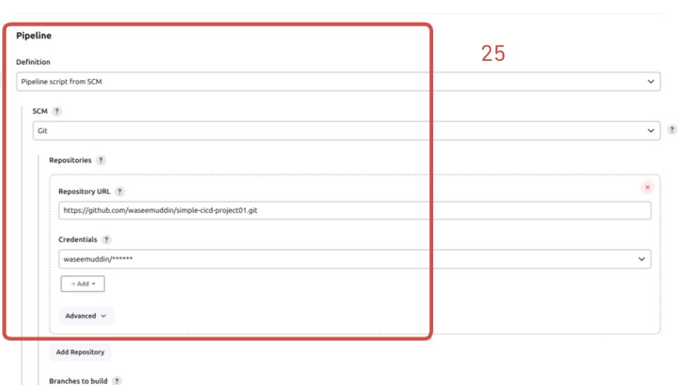

# Simple CICD Pipeline Project - Todo Application 

Welcome to the Simple CICD Pipeline Project for a Todo Application. Follow the steps below to set up your Continuous Integration and Continuous Deployment pipeline.

## Prerequisites
Ensure you have the following prerequisites before proceeding:
1. **EC2 Machine**: Medium Size preferred.
2. **Docker Setup** on EC2 Machine.
3. **Jenkins Setup**: You can either manually install Jenkins or use a Jenkins image.
4. **GitHub Account**: You need a GitHub account to automate the pipeline.

For more updates and projects, visit:
- 💾 [shaikhwaseem.com](https://shaikhwaseem.com)
- 💾 [YouTube Channel](https://www.youtube.com/@waseeemuddin)

## Architecture Diagram


### Step 01 - Create EC2 Machine 


### Step 02 - Connect EC2 Machine  
Connect to your EC2 Ubuntu Machine using SSH. Make sure you're in the root user or use 'sudo'.
```shell
$ sudo ssh -i "key.pem" ubuntu@<ip-address>
```


### Step 03 - Install Docker on EC2 Machine
Install Docker on your EC2 machine. Use the following commands:

### Set up Docker's apt repository.

```shell
$ sudo apt-get update
$ sudo apt-get install ca-certificates curl
$ sudo install -m 0755 -d /etc/apt/keyrings
$ sudo curl -fsSL https://download.docker.com/linux/ubuntu/gpg -o /etc/apt/keyrings/docker.asc
$ sudo chmod a+r /etc/apt/keyrings/docker.asc
$ echo \
  "deb [arch=$(dpkg --print-architecture) signed-by=/etc/apt/keyrings/docker.asc] https://download.docker.com/linux/ubuntu \
  $(. /etc/os-release && echo "$VERSION_CODENAME") stable" | \
  sudo tee /etc/apt/sources.list.d/docker.list > /dev/null
$ sudo apt-get update

# Install Docker packages.
$ sudo apt-get install docker-ce docker-ce-cli containerd.io docker-buildx-plugin docker-compose-plugin
```


### Step 04 - Installation of Jenkins

Install Jenkins either manually or using container-based installation. Here's the container-based installation command:

```shell
$ docker run -p 8080:8080 -p 50000:50000 -d \
-v jenkins_home:/var/jenkins_home \
-v /var/run/docker.sock:/var/run/docker.sock \
-v $(which docker):/usr/bin/docker jenkins/jenkins:lts
```


After running the above command, Jenkins container will be created and started. Access Jenkins using the IP address of your EC2 machine followed by port 8080.


Now you can type blow ip addess if your ec2 machine and check weather your jenkins is accessiable or not 
But make sure that the port should be added on your EC2 Security Group

# 
# 


``` shell
$ localhost:8080

$ <ip-address>:porty

```
# 

Now, In order to get the jenkins password. you have to login or access the jenkins container

``` shell
$ docker exec -it <container-id> bash

$ docker exec -it 98760878abree bash

```
# 


### Step 04 - Jenkins Pipeline Setup

Now that we have set up our EC2 server, Docker, and Jenkins, let's create a simple Jenkins pipeline.

Before creating the pipeline, ensure your Git repository is up to date. Use the following links to update:


- 💾 [Simple CICD Project Repo](https://github.com/waseemuddin/simple-cicd-project01.git)

- 💾 [Docker Official Repo](https://github.com/docker/getting-started-app.git)

Log in to Jenkins using the password generated during setup.


Choose 'Pipeline' and 'Pipeline Script from SCM', using the Jenkinsfile provided in your Git repository.





After setting up the pipleline and connected to git repo. now lets test the below code and see your our pipeline works or not

First create the Jenkinsfile in your git repo and add the below code in Jenkinsfile

``` shell
pipeline {
    agent any
    stages {
        stage("Code checkout") {
            steps {
               git branch: 'main', credentialsId: 'github-id', url: 'https://github.com/waseemuddin/simple-cicd-project01.git'
            }
        }
    }
}
```


Now Jenkinsfile has been updated. Goto pileline and press the "Build Now" to check the pipeline fetch git repo and shows the stage view. 


### Step 05 - Jenkins Set Webhook - Automate the Pipeline Process

To automate the Jenkins pipeline, we'll set up a Git webhook. Navigate to your repository settings and add a webhook with the Jenkins server's IP and port.


### Step 06 - Final Step - Run Complete Code

In the final step, we create a complete pipeline from code checkout to container creation.

The updated code is available in the Jenkinsfile. Ensure you have an empty repository on your Docker Hub account for image storage.


``` shell
pipeline {
    agent any

    stages {
        stage("Code checkout") {  # Git Repo Check-out Step
            steps {
               git branch: 'main', credentialsId: 'github-id', url: 'https://github.com/waseemuddin/simple-cicd-project01.git'
            }
        }
        stage("image build") {  # Image Build Step and make sure you have to create the empty repository on your Docker-Hub Account
            steps {
                sh 'docker image build -t waseem63/mydockerapp:v$BUILD_ID .'
                sh 'docker image tag waseem63/mydockerapp:v$BUILD_ID waseem63/mydockerapp:latest'
            }
        }
        stage("Image Push") {  # Image Push Step and connect to your docker-hub account. Also remove the image so the storage can be maintain
            steps { 
                withCredentials([usernamePassword(credentialsId: 'docker-hub-id', passwordVariable: 'PASS', usernameVariable: 'USER')]) {
                    
                    sh "echo $PASS | docker login -u $USER --password-stdin"
                    sh 'docker push waseem63/mydockerapp:v$BUILD_ID'
                    sh 'docker push waseem63/mydockerapp:latest'
                    sh 'docker rmi waseem63/mydockerapp:v$BUILD_ID  waseem63/mydockerapp:latest'
                }
            }
            
        }
        stage("Container Creating") { # last step is to fetch the lastet or recent image and create docker container automatically.
            steps {
                sh 'docker run -itd --name todoapp -p 3000:3000 waseem63/mydockerapp:latest'
            
            }
        }
        
    }
}
```


Now, any push to the repository will trigger the Jenkins pipeline automatically.

Congratulations! You have successfully set up a CI/CD pipeline for your Todo Application.

